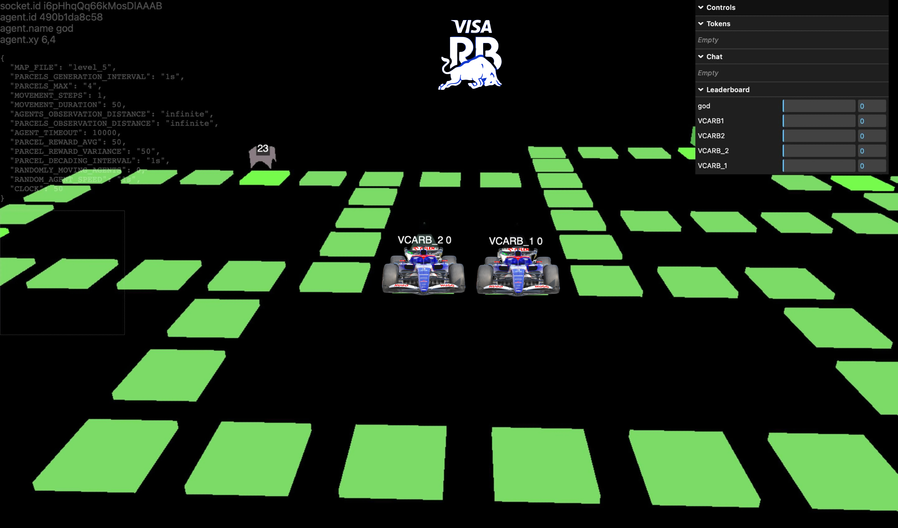

# Deliveroo Visa Cash App Racing Bulls




## Introduction
Welcome to Deliveroo's Unitn challenge! This project aims to develop intelligent agents capable of navigating through a randomized map to pick up blocks and deliver them to designated locations. The challenge consists of multiple stages (Q1, Q2, Q3, etc.), where agents compete to gather the most blocks to advance to the next stage.

## First Challenge: Agent Movement and Basic Actions [6th Position] 
The first challenge focuses on implementing the basic functionalities of the agent, including movement, pickup, and putdown actions. Key features include:

- **Agent Movement**: Implement agent movement on a grid-based map, allowing navigation in four directions (up, down, left, right).
- **Block Pickup and Delivery**: Enable the agent to pick up blocks from designated locations and deliver them to delivery zones.
- **Map Management**: Develop a system to represent the map with different block types (e.g., pickup zones, delivery zones, neutral blocks) using numerical values.
- **Planning**: Implement a planning system (e.g., A*) to determine the agent's actions based on the current map state and block locations.

## Second Challenge: Multi-Agent Planning and Communication [4th Position] 
The second challenge will involve the following tasks:

- **Creation of Agent 2**: Develop a second agent with similar capabilities to cooperate with the first agent.
- **Planning with PDDL**: Utilize Planning Domain Definition Language (PDDL) to create high-level plans for both agents.
- **Communication**: Implement communication between the agents to coordinate actions and optimize block collection strategies.

## Installation

### Server Installation
To set up the server-side of the Deliveroo Challenge, follow these steps:

1. Clone the repository:
    ```bash
    git clone https://github.com/unitn-ASA/Deliveroo.js.git
    ```
2. Navigate to the server directory:
    ```bash
    cd Deliveroo.js
    ```
3. Install the necessary dependencies:
    ```bash
    npm install
    ```
4. Start the server with the desired level:
    ```bash
    node index.js level_1
    ```

### Client Installation
To set up the client-side of the Deliveroo Challenge, follow these steps:

1. Clone the repository:
    ```bash
    git clone https://github.com/Daniel203/ASA-project-unitn.git
    ```
2. Navigate to the client directory:
    ```bash
    cd ASA-project-unitn
    ```
3. Install the necessary dependencies:
    ```bash
    npm install
    ```
4. Start the client:
    ```bash
    npm start
    ```

